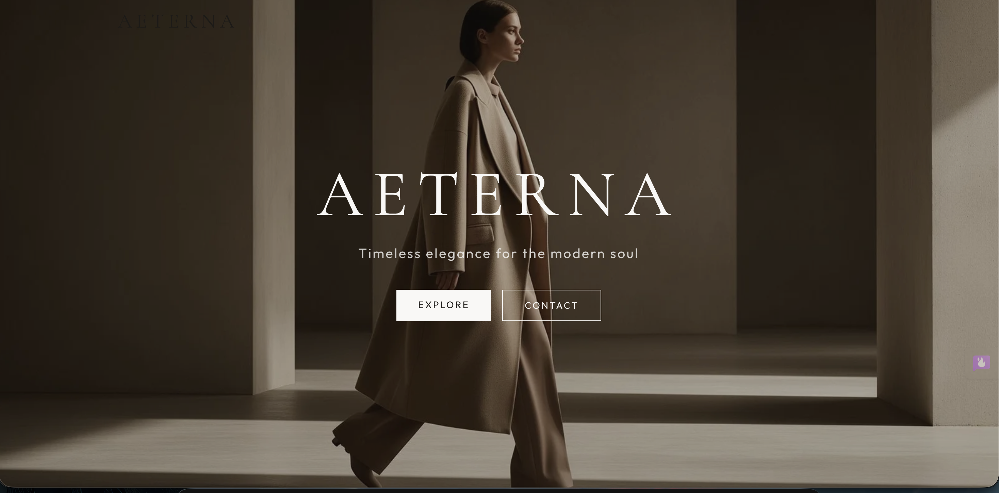
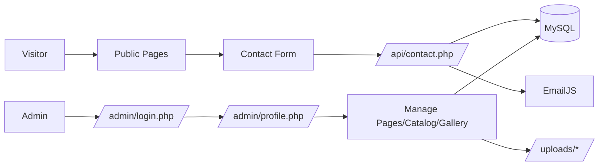
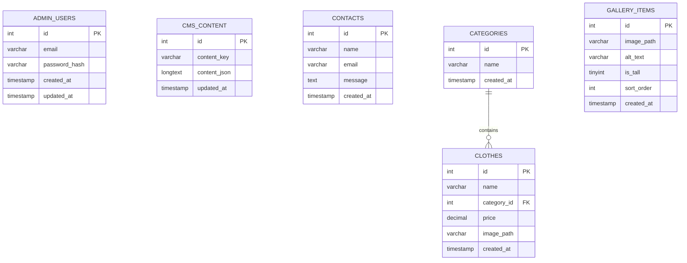

# Aeterna

<p align="center">
  
</p>

<p align="center">
  <strong>Timeless elegance for the modern soul.</strong><br/>
  Luxury fashion showcase website with an admin CMS, catalog management, gallery uploads, and contact workflow.
</p>

<p align="center">
  
  
  
  
</p>

---

## Contents

- [Project Overview](#project-overview)
- [Key Features](#key-features)
- [Visual Architecture](#visual-architecture)
- [Tech Stack](#tech-stack)
- [Project Structure](#project-structure)
- [Local Setup](#local-setup)
- [Environment Variables](#environment-variables)
- [Database & Migration](#database--migration)
- [Admin Access](#admin-access)
- [API Reference](#api-reference)
- [Content & Asset Management](#content--asset-management)
- [Troubleshooting](#troubleshooting)
- [Roadmap Ideas](#roadmap-ideas)
- [License](#license)

## Project Overview

Aeterna is a premium-styled PHP web experience for a fashion brand. It includes:

- Public-facing pages for home, about, collections, gallery, FAQ, and contact.
- Admin portal for managing content and catalog.
- JSON + database-backed CMS content model.
- Contact submission API with optional EmailJS notification delivery.
- Image upload flows for gallery and clothing management.

This codebase is intentionally lightweight, framework-free, and easy to deploy on shared hosting.

## Key Features

- Elegant luxury front-end styling with curated typography and brand visuals.
- Dynamic home page content editor (`hero`, `featured`, and `quote` blocks).
- Admin management for collections (`categories`) and clothing items.
- Gallery manager with upload, edit, reorder, and delete controls.
- Contact form persistence to database plus optional EmailJS notifications.
- Automatic bootstrap for `admin_users` and `cms_content` tables.
- Fallback safety: CMS content can persist to `storage/content.json`.

## Visual Architecture

### App Flow



### Data Model (Core)



## Tech Stack

- PHP 8.1+ (plain PHP, no framework)
- MySQL / MariaDB via PDO
- Tailwind-style utility classes + custom CSS assets
- EmailJS for optional notification dispatch
- File-based uploads for gallery and catalog images

## Project Structure

```text
Aeterna/
├── index.php, about.php, collections.php, gallery.php, contact.php, faq.php
├── admin/
│   ├── login.php
│   ├── profile.php
│   ├── home-page.php
│   ├── about-page.php
│   ├── contact-page.php
│   ├── faq-page.php
│   ├── categories.php
│   ├── clothes.php
│   └── gallery.php
├── api/
│   └── contact.php
├── includes/
│   ├── bootstrap.php
│   ├── admin_auth.php
│   ├── cms_content.php
│   └── contact_mail.php
├── database/
│   └── migrate.php
├── sql/
│   └── schema.sql
├── assets/
├── uploads/
├── storage/
└── .env / .env.example
```

## Local Setup

1. Clone the project.
2. Copy env template:

```bash
cp .env.example .env
```

3. Update DB and admin values in `.env`.
4. Run migrations:

```bash
php database/migrate.php
```

5. Start local server from project root:

```bash
php -S 127.0.0.1:8000
```

6. Open in browser:

- Public site: `http://127.0.0.1:8000/`
- Admin login: `http://127.0.0.1:8000/admin/login.php`

## Environment Variables

`Aeterna` reads environment values from `.env`.

```env
APP_URL=http://localhost
APP_TIMEZONE=Asia/Colombo

DB_HOST=localhost
DB_PORT=3306
DB_USER=root
DB_PASSWORD=
DB_NAME=aeterna
DB_CHARSET=utf8mb4
# DB_SOCKET=/var/lib/mysql/mysql.sock

CORS_ORIGIN=*

ADMIN_EMAIL=admin@example.com
ADMIN_PASSWORD=admin123

EMAILJS_SERVICE_ID=
EMAILJS_TEMPLATE_ID=
EMAILJS_PUBLIC_KEY=
EMAILJS_PRIVATE_KEY=
EMAILJS_API_URL=https://api.emailjs.com/api/v1.0/email/send
```

## Database & Migration

Run migration script:

```bash
php database/migrate.php
```

What it does:

- Creates database if missing.
- Creates tables: `admin_users`, `cms_content`, `contacts`, `categories`, `clothes`, `gallery_items`.
- Seeds first admin user from `ADMIN_EMAIL` + `ADMIN_PASSWORD` when empty.
- Seeds CMS `site` content from `storage/content.json` defaults.

## Admin Access

Admin login URL:

- `http://127.0.0.1:8000/admin/login.php`

Default credentials come from `.env`:

- Email: `ADMIN_EMAIL`
- Password: `ADMIN_PASSWORD`

Admin areas include:

- Profile dashboard with content counts.
- Page content management (`home`, `about`, `contact`, `faq`).
- Collection management (`categories`).
- Clothing catalog management with image upload (`clothes`).
- Gallery management with image upload and sort ordering (`gallery`).

## API Reference

### `POST /api/contact.php`

Saves a contact message and attempts EmailJS notification.

Request JSON:

```json
{
  "name": "Jane Doe",
  "email": "jane@example.com",
  "message": "I would like to book a private showroom visit."
}
```

Success response:

```json
{
  "success": true,
  "id": 1,
  "mail_sent": true,
  "warning": null
}
```

Validation rules:

- `name`: required, max 100 chars
- `email`: required, valid email, max 255 chars
- `message`: required, max 5000 chars

### `GET /api/contact.php`

Returns stored contact entries ordered by newest first.

## Content & Asset Management

- CMS text content is persisted in DB table `cms_content` under key `site`.
- File backup is maintained in `storage/content.json`.
- Uploaded gallery files are stored in `uploads/gallery/`.
- Uploaded clothing files are stored in `uploads/clothes/`.
- Upload limits and allowed types are validated server-side.

## Troubleshooting

- DB connection errors: verify `DB_*` values and MySQL availability.
- Login issues: run migration again to ensure `admin_users` is seeded.
- Contact emails not sending: verify EmailJS keys and template mappings.
- Upload failures: check PHP upload limits and write permissions on `uploads/`.

## Roadmap Ideas

- Add CSRF protection on all admin forms.
- Add pagination and search for contacts and catalog items.
- Add image optimization pipeline and CDN support.
- Add automated tests for API and admin flows.
- Add Docker-based local development setup.

## License

MIT License. See `LICENSE` for details.
